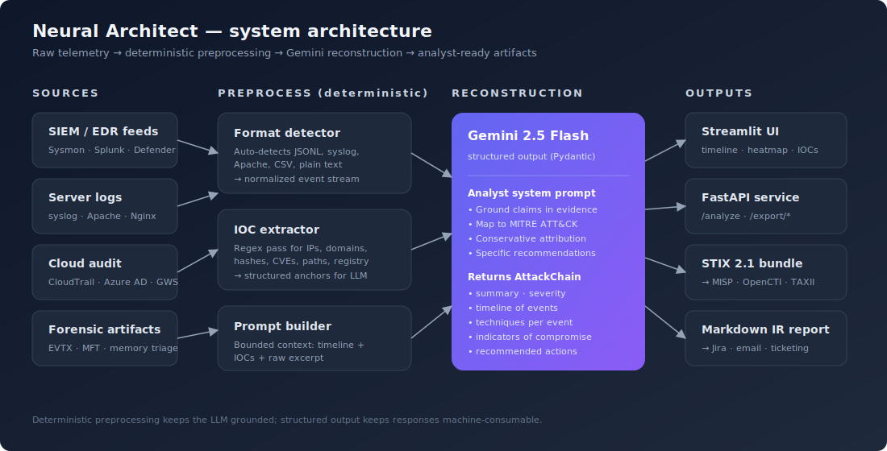

<div align="center">

# 🧠 Neural Architect

### AI-powered digital forensics. Reconstruct attack chains and map to MITRE ATT&CK in seconds.

Drop in raw logs — get back a timeline, a kill-chain narrative, scored MITRE techniques, indicators of compromise, and a SOC-ready STIX 2.1 bundle.

[](https://github.com/Ravioli201/neural-architect/actions/workflows/ci.yml)


[**Live demo**](#-live-demo)  ·  [**Architecture**](docs/architecture.md)  ·  [**Eval methodology**](eval/README.md)  ·  [**API docs**](#-api)

</div>

---

## The problem

Tier-1 SOC analysts spend most of their day doing the same thing: staring at pages of `Sysmon` events, `auth.log` lines, and EDR alerts trying to answer one question — *what actually happened?* By the time they've stitched events into a story, mapped them to MITRE, and written it up, the attacker has had hours to keep going.

**Neural Architect compresses that work from hours to seconds.** Paste in raw telemetry, get back the reconstructed attack chain, scored MITRE techniques, IOCs, and a markdown IR report ready to paste into a ticket.

## Demo

> *(Replace this section with a 30–60s Loom or screen recording. The hero GIF is what most LinkedIn viewers will watch — make it good.)*


## How it works



The trick is **not** "throw 50 KB of logs at an LLM and hope." Raw logs go through a deterministic preprocessing pass — format detection, IOC extraction, timeline normalization — and only *then* hit Gemini 2.5 Flash with a Pydantic-schema-constrained prompt. The model gets structured anchors, returns structured output, and we never spend tokens on work that regex does better.

Full design rationale in [docs/architecture.md](docs/architecture.md).

## What you get back

For every incident, the pipeline produces a typed `AttackChain` containing:

- One-paragraph executive summary
- Severity (low / medium / high / critical) grounded in impact, not vibes
- Chronological event list, each tagged with kill-chain phase + MITRE techniques + confidence + rationale
- Deduped indicators of compromise (IPs, domains, hashes, paths, CVEs, registry keys, …)
- Conservative actor attribution — only when TTPs strongly match a documented group, otherwise null
- Specific recommended actions (containment, investigation, hardening) — not generic platitudes
- Model notes calling out gaps, ambiguity, or low-confidence calls

## Quick start

```bash
git clone https://github.com/Ravioli201/neural-architect
cd neural-architect

python -m venv .venv && source .venv/bin/activate
pip install -r requirements.txt

cp .env.example .env
# Add your Gemini API key — get one free at https://aistudio.google.com/apikey

# Streamlit UI
./scripts/run_streamlit.sh

# Or, the FastAPI service
./scripts/run_api.sh

# Or, the CLI
PYTHONPATH=src python -m neural_architect.cli analyze data/samples/apt_phishing_to_ransomware.log
```

## Try it without writing any logs

Three synthetic-but-realistic scenarios are bundled in [`data/samples/`](data/samples/README.md):

| Scenario | What it covers |
|----------|----------------|
| `apt_phishing_to_ransomware.log` | Macro doc → PowerShell loader → cred dump → lateral move via PsExec → ransomware |
| `web_exploit_to_rce.log`         | WordPress brute force → malicious plugin → web shell → reverse SSH |
| `insider_data_exfil.log`         | Departing employee accessing restricted files, exfil to cloud + USB |

## Evaluation

Most LLM security demos have *zero* rigor. This one ships an eval harness with golden labels, precision/recall/F1 scoring at parent-technique granularity, and latency tracking:

```bash
python -m eval.benchmark --runs 3
```

Methodology and caveats: [eval/README.md](eval/README.md).

## API

```http
POST /analyze            → AttackChain JSON
POST /export/stix        → STIX 2.1 bundle
POST /export/markdown    → IR report (Markdown)
GET  /health             → liveness + config status
```

```bash
curl -X POST http://localhost:8000/analyze \
  -H 'content-type: application/json' \
  -d '{"logs": "..."}' | jq .
```

OpenAPI spec is auto-generated at `/docs` when the API is running.

## Project layout

```
neural-architect/
├── src/neural_architect/
│   ├── core/         # Models, log parser, IOC extractor, analyzer
│   ├── llm/          # Gemini client + prompts
│   ├── exporters/    # STIX 2.1, Markdown
│   ├── api/          # FastAPI service
│   ├── ui/           # Streamlit app
│   └── cli.py        # Command-line entrypoint
├── data/samples/     # Synthetic incident logs you can feed to the analyzer
├── eval/             # Benchmark harness + golden labels
├── tests/            # pytest suite
├── docs/             # Architecture + design notes
├── assets/           # Diagrams + demo media
└── scripts/          # Local run helpers
```

## Roadmap

- [ ] Streaming reconstruction — emit events as the model produces them
- [ ] Chunked analysis for very large incidents (multi-hour log captures)
- [ ] RAG over historical reconstructions to identify repeat actors
- [ ] Sigma rule generation from reconstructed events
- [ ] One-click incident export to TheHive / OpenCTI / MISP

## Tech stack

Gemini 2.5 Flash · Pydantic v2 · FastAPI · Streamlit · Plotly · STIX 2.1 · scikit-learn (eval) · pytest

## Contributing

PRs welcome — especially additional golden samples for the eval harness, additional log format parsers, and improvements to the analyst system prompt. See [`tests/`](tests/) for the existing test patterns.

## License

MIT — see [LICENSE](LICENSE).

## Disclaimer

Neural Architect is an analyst *augmentation* tool, not a replacement. Verify reconstructions before acting on them, especially in IR engagements where mistakes are expensive. The model can be wrong; the `model_notes` field is meant to be read, not skipped.
